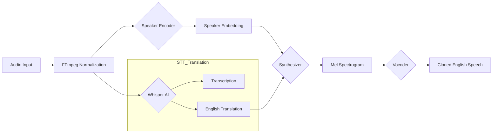

# OmniVoice AI
## Multilingual Speech-to-Speech Translation & Voice Cloning

OmniVoice AI is a high-performance framework designed to bridge linguistic barriers while preserving the unique vocal identity of the speaker. By integrating OpenAI's Whisper with state-of-the-art Real-Time Voice Cloning (RTVC), the system enables seamless translation from Indian regional languages into natural-sounding English speech that mirrors the original speaker's prosody, tone, and timbre.

---

## 📋 Table of Contents
- [Overview](#overview)
- [System Architecture](#system-architecture)
- [Key Features](#key-features)
- [Technical Stack](#technical-stack)
- [Getting Started](#getting-started)
- [Deployment & Usage](#deployment--usage)
- [Roadmap](#roadmap)
- [License](#license)

---

## Overview

Unlike traditional speech translation systems that output generic synthetic voices, OmniVoice AI utilizes zero-shot voice cloning to generate a digital twin of the speaker's voice. This ensures that the translated output maintains the emotional context and personal identity of the source audio.

### Core Value Proposition
- **Identity Preservation**: Retains the speaker's unique vocal characteristics across languages.
- **Regional Support**: Optimized for Indian regional languages (Hindi, Tamil, Telugu, etc.).
- **Frictionless UX**: A premium, dark-mode interface designed for real-time interaction.
- **Robustness**: Integrated FFmpeg pipeline for reliable audio normalization across all formats.

---

## System Architecture

The following diagram illustrates the data flow from raw audio input to the synthesized, cloned output.



---

## Key Features

| Feature | Description |
| :--- | :--- |
| **Zero-Shot Cloning** | Generates a voice clone from as little as 5 seconds of reference audio. |
| **Auto-Language Detection** | Automatically identifies the source language using Whisper's intelligence. |
| **Real-Time Visuals** | Dynamic waveform generation for both input and output audio. |
| **Confidence Scoring** | Provides transparency on the accuracy of the transcription and translation. |
| **History Persistence** | Tracks recent sessions with a modular sidebar for quick review. |
| **Feedback Loop** | Integrated logging mechanism for continuous model evaluation. |

---

## Technical Stack

- **Speech Processing**: OpenAI Whisper (STT/Translation)
- **Voice Synthesis**: Real-Time Voice Cloning (Encoder, Synthesizer, Vocoder)
- **Interface**: Gradio Blocks (Premium Dark Theme)
- **Audio Engineering**: FFmpeg, Librosa, Pydub, SoundFile
- **Inference Engine**: PyTorch (CUDA Optimized)

---

## Getting Started

### Prerequisites
- **Python**: 3.8 or 3.9 (Strictly recommended for model compatibility)
- **FFmpeg**: Required for audio format conversion and normalization

### Installation

1. **Clone the Repository**
   ```bash
   git clone https://github.com/AmanDevNet/Multilingual-Voice-Translation-System.git
   cd Multilingual-Voice-Translation-System
   ```

2. **Environment Setup**
   ```bash
   python -m venv env_translation
   # Windows
   .\env_translation\Scripts\activate
   # macOS/Linux
   source env_translation/bin/activate
   ```

3. **Install Dependencies**
   ```bash
   pip install -r requirements.txt
   ```

4. **Model Initialization**
   Place the pre-trained weights in `saved_models/default/`:
   - [Encoder Model](https://drive.google.com/file/d/1q8mEGwCkFy23KZsinbuvdKAQLqNKbYf1/view)
   - [Synthesizer Model](https://drive.google.com/file/d/1EqFMIbvxffxtjiVrtykroF6_mUh-5Z3s/view)
   - [Vocoder Model](https://drive.google.com/file/d/1cf2NO6FtI0jDuy8AV3Xgn6leO6dHjIgu/view)

---

## Deployment & Usage

Start the application server:
```bash
python main.py
```
Access the interface at `http://localhost:7860`.

### Best Practices for Optimal Results
- **Audio Quality**: Use clear, noise-free audio for the reference sample.
- **Reference Duration**: 5-10 seconds of speech provides the best speaker embedding.
- **Hardware**: While CPU is supported, a CUDA-enabled GPU is highly recommended for real-time performance.

---

## Roadmap

- [ ] Support for multiple output target languages beyond English.
- [ ] Integration of faster inference backends (TensorRT / ONNX).
- [ ] Real-time streaming translation capabilities.
- [ ] Packaging as a Dockerized microservice for cloud scaling.

---

## Acknowledgements

- **OpenAI** for the Whisper STT engine.
- **CorentinJ** for the foundational Real-Time Voice Cloning implementation.

---

## Contact

**Aman Sharma**  
Email: [theamansharma.27@gmail.com](mailto:theamansharma.27@gmail.com)  
GitHub: [@AmanDevNet](https://github.com/AmanDevNet)

---

## License

This project is licensed under the MIT License. See the [LICENSE](LICENSE) file for details.
