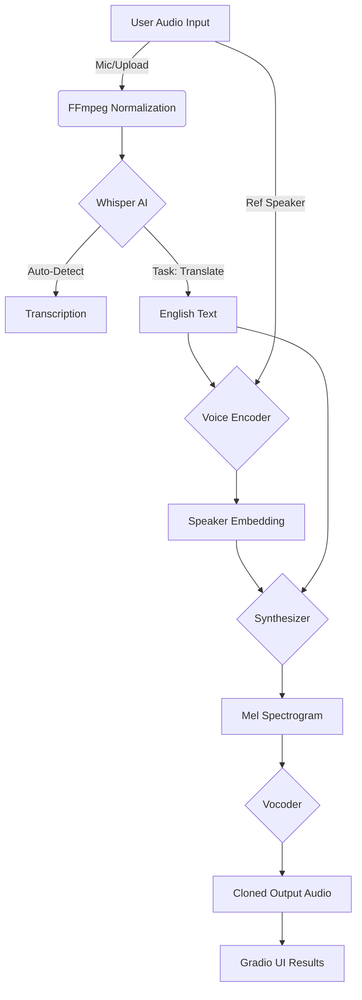

# 🌐 OmniVoice AI: Multilingual Voice Translation & Zero-Shot Cloning

[](https://www.python.org/downloads/release/python-380/)
[](https://gradio.app/)
[](https://github.com/openai/whisper)
[](https://opensource.org/licenses/MIT)

**OmniVoice AI** is a high-performance, real-time voice translation system that bridges linguistic gaps while preserving the unique identity of the speaker's voice. Speak in any supported language (Hindi, Tamil, Telugu, etc.), and hear your words rendered instantly in English—with your exact vocal tone, emotion, and prosody.

---

## ✨ Key Features

- 🎙️ **Zero-Shot Voice Cloning**: Capture the essence of any voice from just a few seconds of audio.
- 🌍 **Multilingual STT**: State-of-the-art transcription using OpenAI Whisper.
- ⚡ **Real-Time Translation**: Seamlessly translate Indian regional languages to English.
- 🧠 **Auto-Language Detection**: Simply speak; the AI identifies the language for you.
- 📊 **Confidence Scoring**: Real-time feedback on transcription accuracy.
- 🎨 **Premium UI/UX**: A sleek, dark-mode "FAANG-style" interface built with Gradio Blocks.
- 🕒 **Translation History**: Keep track of your recent clones with a persistent sidebar.

---

## 🏗️ System Architecture



---

## 🚀 Getting Started

### 1. Prerequisites
- **Python 3.8.1** (Required for compatibility with cloning models).
- **FFmpeg**: Essential for audio processing.

### 2. Installation

1. **Clone the Repository**
   ```bash
   git clone https://github.com/AmanDevNet/Multilingual-Voice-Translation-System.git
   cd Multilingual-Voice-Translation-System
   ```

2. **Create & Activate Environment**
   ```bash
   # Using Virtualenv
   python -m venv env_translation
   .\env_translation\Scripts\activate
   ```

3. **Install Dependencies**
   ```bash
   pip install -r requirements.txt
   ```

### 3. Model Setup
Download the pre-trained models and place them in `saved_models/default/`:
- [Encoder](https://drive.google.com/file/d/1q8mEGwCkFy23KZsinbuvdKAQLqNKbYf1/view) (`encoder.pt`)
- [Synthesizer](https://drive.google.com/file/d/1EqFMIbvxffxtjiVrtykroF6_mUh-5Z3s/view) (`synthesizer.pt`)
- [Vocoder](https://drive.google.com/file/d/1cf2NO6FtI0jDuy8AV3Xgn6leO6dHjIgu/view) (`vocoder.pt`)

---

## 🎮 Usage

Run the application with:
```powershell
.\env_translation\Scripts\python.exe main.py
```

1. **Upload or Record**: Provide an audio sample (3-10 seconds recommended).
2. **Select Language**: Use "Auto-detect" or choose manually.
3. **Generate**: Click **Translate & Clone Voice** and watch the magic happen.
4. **Export**: Use the **Download** button to save your cloned audio results.

---

## 🛠️ Tech Stack

- **Speech-to-Text**: [OpenAI Whisper](https://github.com/openai/whisper)
- **Voice Cloning**: [Real-Time Voice Cloning](https://github.com/CorentinJ/Real-Time-Voice-Cloning)
- **UI Framework**: [Gradio](https://gradio.app/)
- **Audio Processing**: [Librosa](https://librosa.org/), [Pydub](http://pydub.com/), [SoundFile](https://pysoundfile.readthedocs.io/)

---

## 📜 License

Distributed under the MIT License. See `LICENSE` for more information.

## 🤝 Acknowledgments

Special thanks to the open-source communities of **OpenAI** and **CorentinJ** for providing the foundational models that make this project possible.

---
**Developed by Aman Sharma**
[GitHub](https://github.com/AmanDevNet) | [Contact](mailto:theamansharma.27@gmail.com)
